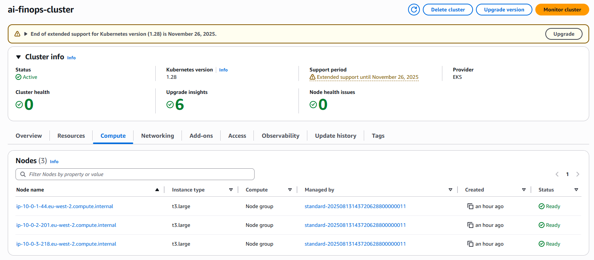
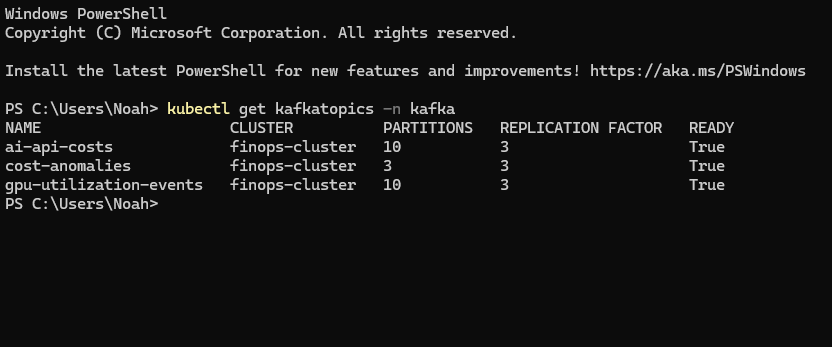
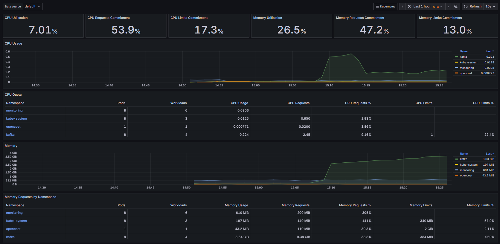
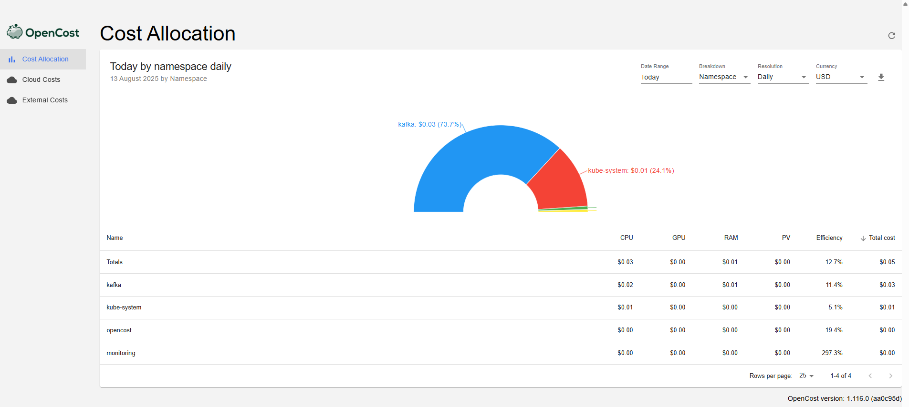
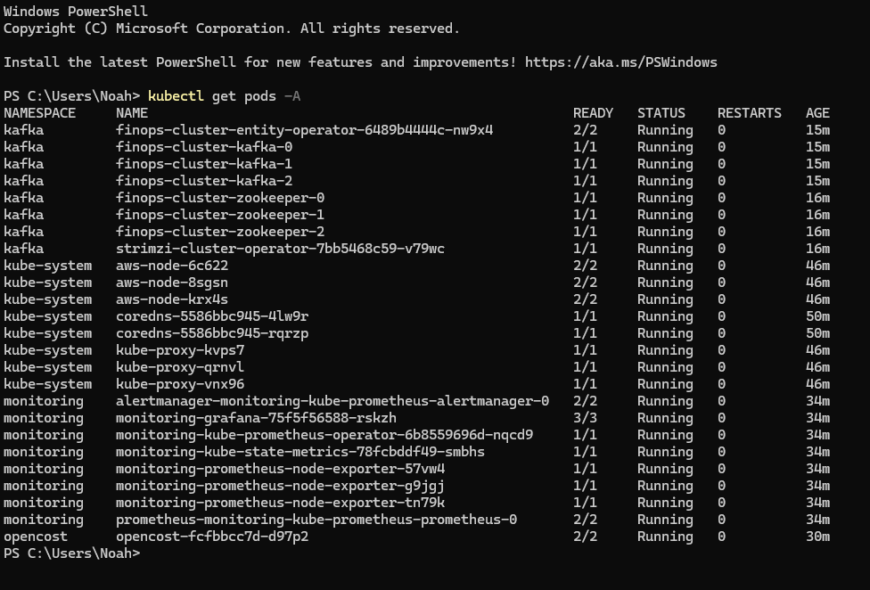

# Project 18: AI FinOps Platform

Apache Kafka streaming on Kubernetes using Strimzi operator. OpenCost, Prometheus, and Grafana for metrics collection. Event processing for GPU and API costs.

## Technologies

AWS EKS • Apache Kafka • Strimzi • OpenCost • Prometheus • Grafana • Terraform • Kubernetes

## Screenshots

